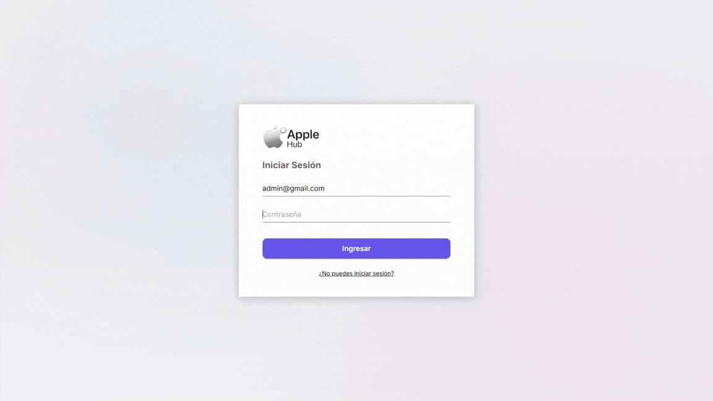

# 🍏 Apple Hub

Sistema de gestión empresarial basado en roles para optimizar stock, finanzas e integridad de datos en tiendas minoristas de productos Apple en Colombia.



[](https://apple-hub.vercel.app/)

---

## 📋 Descripción

**Apple Hub** es una aplicación full-stack que permite la gestión integral de una tienda minorista distribuidora de productos Apple. La plataforma implementa un sistema CRUD completo con autenticación segura y control de acceso basado en roles.

## 🎯 Problemática

Las tiendas minoristas de productos Apple en ciudades pequeñas e intermedias de Colombia enfrentan desafíos críticos:

- **Manipulación de datos:** falta de trazabilidad en las operaciones del inventario y de ventas
- **Fugas de capital:** control financiero deficiente que genera pérdidas no contabilizadas
- **Procesos manuales ineficientes:** registro en hojas de cálculo propenso a errores humanos e iteraciones innecesarias
- **Ausencia de roles:** todos los empleados tienen acceso total a información sensible

Estos problemas impiden un control financiero preciso, generan inconsistencias en el inventario y dificultan un manejo seguro del flujo de caja.

## 💡 Solución

Apple Hub resuelve estas problemáticas mediante:

- **Sistema basado en roles** que restringe operaciones según el nivel de acceso  
- **Registro automático** de todas las transacciones con trazabilidad completa  
- **Control de inventario en tiempo real** para evitar pérdidas o discrepancias  
- **Módulo financiero** que calcula ganancias y genera reportes automáticos  
- **Seguridad robusta** con autenticación JWT y encriptación de contraseñas

## 🛠️ Stack tecnológico

- **Frontend:** [Next.js](https://nextjs.org/) con App Router y Server Components
- **Backend:** API Routes de Next.js
- **Base de datos:** [PostgreSQL](https://www.postgresql.org/) desplegada en [Supabase](https://supabase.com/)
- **Autenticación:** JWT (JSON Web Tokens) + Bcrypt
- **Estilos:** Tailwind CSS v4 + CSS Modules
- **Deploy:** [Vercel](https://vercel.com/) (CI/CD automático)

## 🏗️ Arquitectura y decisiones técnicas

### 👷🏻‍♂️ Patrón de arquitectura
- **Arquitectura full-stack** con separación clara entre capa de presentación (React Client Components) y lógica de negocio (API Routes)
- **SSR + Hidratación:** Renderizado inicial en servidor con interactividad del cliente mediante React hooks y event handlers
- **API RESTful** mediante Next.js API Routes con validación de datos en ambos extremos

### 🔒 Seguridad
- **Sistema RBAC** (Role-Based Access Control) que restringe operaciones según roles de usuario
- **Autenticación JWT** con tokens de sesión seguros y refresh tokens
- **Encriptación de contraseñas** con Bcrypt (salt rounds: 10)
- **Validación de entrada** en cliente y servidor para prevenir inyecciones SQL y XSS

### 📝 Base de datos
- **Modelo relacional con PostgreSQL** para integridad referencial y transacciones ACID
- **Índices optimizados** en columnas de búsqueda frecuente

## ✨ Funcionalidades principales

### 🙋🏻‍♂️ Gestión de usuarios
- Creación y administración de cuentas de empleados
- Asignación de roles (Administrador/Empleado)
- Actualización de información del perfil
- Auditoría de acciones por usuario

### 📦 Gestión de productos
- Catálogo completo de productos oficiales Apple
- Registro de precios, stock y especificaciones técnicas
- Actualización en tiempo real del inventario
- Eliminación de productos descatalogados (solo Admin)

### 🛒 Gestión de pedidos
- Creación y seguimiento de órdenes de compra
- Estados del pedido: *En proceso → Enviado → Entregado → Devuelto*
- Registro de devoluciones y gestión de garantías
- Historial completo de transacciones

### 💸 Módulo financiero
- Dashboard de ingresos diarios
- Histórico de ganancias con filtros por período
- Cálculo automático de márgenes de utilidad
- Reportes exportables para análisis

### 🛡️ Panel administrativo
- Gestión de roles y permisos de usuarios
- Monitoreo de actividad y auditoría del sistema
- Configuración avanzada de parámetros de la tienda
- Administración de reportes y exportación de datos

## 🚀 Instalación y configuración

### Prerrequisitos
- **Node.js** >= 22.x
- **npm** >= 9.x
- **PostgreSQL** >= 18.x 

### 1. Clonar el repositorio
```bash
git clone https://github.com/jmncamilo/apple-hub.git
cd apple-hub
```

### 2. Instalar dependencias
```bash
npm install
```

### 3. Configurar variables de entorno
Crea un archivo `.env.local` en la raíz del proyecto con las siguientes variables:

```env
# Despliegue
DATABASE_URL=your_db_url_deployed
NEXT_PUBLIC_BASE_URL=your_client_url
NODE_ENV=production

# Base de datos local
DB_DEFAULT_USER=postgres
DB_HOST=localhost
DB_NAME=apple_hub
DB_PASSWORD_DEFAULT=your_db_password
DB_PORT=5432

# Autenticación
JWT_SECRET=your_jwt_secret
```

> **Nota**: establece `NODE_ENV` en `production` para el despliegue. Para desarrollo, puedes dejarlo vacío.

### 4. Configurar la base de datos
En la carpeta [`/db`](src/lib/db) encontrarás un script llamado `db_script.sql` listo para ejecutar. De esta manera, podrás crear facilmente la base de datos y todas sus tablas. Puedes utilizar tu herramienta favorita para ejecutarlo (CLI, pgAdmin, Supabase, DataGrip, etc.).

> **Nota:** para crear un nuevo usuario, ejecuta el archivo `createUser.js` ubicado [`en la misma carpeta`](src/lib/db) utilizando Node.js. Esto es necesario, ya que la demo limita el uso de módulos adicionales y este repositorio corresponde a una versión reducida del desarrollo principal de Apple Hub.

### 5. Ejecutar en desarrollo
```bash
npm run dev
```

_La aplicación estará disponible en `http://localhost:3000`_

### 6. Construir para producción
```bash
npm run build
npm start
```

## 🌐 Demo

Puedes probar la aplicación en producción: **[apple-hub.vercel.app](https://apple-hub.vercel.app/)**

Para explorar todas las funcionalidades, utiliza las siguientes credenciales según el rol que desees probar:

| Rol | Usuario              | Contraseña | Permisos |
|-----|----------------------|------------|----------|
| 👨‍💼 **Administrador** | `admin@gmail.com`    | `admin`    | Acceso completo (CRUD) |
| 👤 **Empleado** | `empleado@gmail.com` | `empleado` | Acceso limitado (sin permisos de eliminación) |

> Ten en cuenta que esta demo incluye solo una parte de las funcionalidades disponibles en la versión completa de la aplicación.

## 📈 Visión a futuro

Apple Hub busca convertirse en el **sistema operativo interno** de distribuidores minoristas de Apple en Colombia, permitiendo operaciones ágiles, transparentes y confiables.

**Próximas funcionalidades:**
- 📊 Dashboard interactivo para visualizar métricas de negocio
- 💰 Integración con pasarela de pagos y generación de facturas
- 🔔 Integración con servicios de mensajería instantánea
- 📱 Progressive Web App (PWA)
- 🖤 Implementación de tema oscuro

## 💡 Inspiración

La inspiración de este proyecto nace del compromiso de **Apple** con la **excelencia, innovación y simplicidad**. Así como los productos Apple combinan diseño y funcionalidad, **Apple Hub** busca ofrecer la misma experiencia en la administración del negocio: intuitiva, completa y elegante.

## 📄 Licencia

Este proyecto es de código cerrado y forma parte del portafolio profesional de [Camilo Jiménez](https://github.com/jmncamilo).

---

**Desarrollado para revolucionar la gestión de tiendas minoristas de Apple en Colombia**